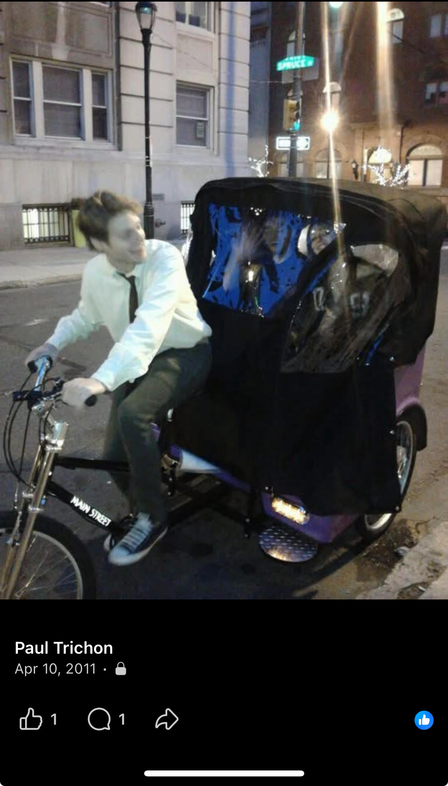

# PurplePedi

The Rolls Royce of PediCabs

---

## Table of contents

1. [Competitive review: Main Street Pedicabs Broadway](#1-competitive-review-main-street-pedicabs-broadway)
2. [What we are building instead](#2-what-we-are-building-instead)
3. [Goals and constraints](#3-goals-and-constraints)
4. [Chassis and layout philosophy](#4-chassis-and-layout-philosophy)
5. [Rear: suspension, wheels, and ride quality](#5-rear-suspension-wheels-and-ride-quality)
6. [Drivetrain and reliability](#6-drivetrain-and-reliability)
7. [Front suspension and steering](#7-front-suspension-and-steering)
8. [Brakes](#8-brakes)
9. [Carriage, passengers, and styling](#9-carriage-passengers-and-styling)
10. [Electrical: battery, lighting, signals, accessories](#10-electrical-battery-lighting-signals-accessories)
11. [Parking brake and operator workflow](#11-parking-brake-and-operator-workflow)
12. [Open decisions and notes](#12-open-decisions-and-notes)
13. [Reference images](#13-reference-images)
14. [PurplePedi: early days (archive)](#14-purplepedi-early-days-archive)

---

## 1. Competitive review: Main Street Pedicabs Broadway

**Vendor product page:** [The Broadway Pedicab (pedicab.com)](https://pedicab.com/product/the-broadway-pedicabs/)

Reference photos (vendor / product imagery):

Main Street Pedicabs’ **Broadway** line appears to be built primarily from **bicycle-scale components** rather than engineered as a **dedicated passenger-transport chassis**. That design choice shows up as both **structural** and **operational** debt in real commercial use.

**Front end and frame**  
The front fork assembly is **underbuilt for repeated loaded duty**: passenger weight, steering side loads, and curb impacts concentrate on a part of the system that was never meant to see that duty cycle on a cargo vehicle. The overall frame reads as a **scaled-up bicycle** more than a **purpose-built trike or carriage-style platform**, which tends to mean **more flex**, more fatigue, and less predictable handling when the vehicle is fully loaded and covering long shifts.

**Wheels and ride quality**  
**Relatively small tires** (for the mass and duty) hurt ride quality: they do not swallow pavement irregularities as well, so the passenger cell feels **harsh and busy** on chipseal, brick, and bad repairs. That is not only a comfort issue; it also **feeds more impulse load into the frame and drivetrain**, accelerating wear and noise.

**Drivetrain and driver experience**  
A **multi-speed bicycle-style drivetrain** with a **long, exposed chain run** is a recurring pain point for operators. Not every gear is usable under load; drivers end up **hunting for a ratio** that works for passenger count, grade, and wind. That is **cognitive load** you do not want on a vehicle that is supposed to feel effortless and premium.

**Chain reliability**  
Chain tension and line are finicky. Too tight or too loose leads to **slip, derailment, or accelerated wear**—failure modes that are annoying on a bike and **unacceptable** on a paid ride.

**Brakes**  
**Hydraulic disc brakes** can still deliver plenty of stopping power, but they **do not fix** underlying **flex, geometry, and load-path** issues. Good brakes on a wobbly or under-damped platform still feel like a compromise.

**Passenger and operator experience (summary)**  
In practice the platform often feels **rough, loud, and tiring** for passengers, while operators fight **gearing, chain behavior, and chassis flex**. The through-line is philosophical: it behaves like a **modified bicycle** carrying people, not like a **small vehicle** designed around passengers from day one.

This review is not about trashing a competitor—it is about **naming the failure modes we are explicitly designing away from** in PurplePedi.

### Broadway — published specifications (reference)

Values below are as listed on the [Broadway product page](https://pedicab.com/product/the-broadway-pedicabs/) for the Broadway model; use for comparison and fact-checking only.

| Spec               | Details                                                                                                      |
| ------------------ | ------------------------------------------------------------------------------------------------------------ |
| Size               | 110″ × 50″                                                                                                   |
| Weight             | 185 lbs.                                                                                                     |
| Frame              | Tubular steel alloy                                                                                          |
| Fork               | 1.125″ chromoly steel                                                                                        |
| Shifters           | 21-speed grip-shifting (7-speed with motor)                                                                  |
| Front derailleur   | Shimano (brand varies by availability)                                                                       |
| Rear derailleur    | Shimano (brand varies by availability)                                                                       |
| Front brakes       | V-brake                                                                                                      |
| Rear brakes        | Hydraulic brake with dual-piston caliper                                                                     |
| Chain              | KMC                                                                                                          |
| Cranks             | FSA 44 × 33 × 22, 175 mm                                                                                     |
| Rims               | Aluminum alloy downhill                                                                                      |
| Hubs               | 48-spoke hubs                                                                                                |
| Spokes             | Stainless steel (DT Swiss) 14G                                                                               |
| Tires              | 26″ × 2.5″, 65 psi                                                                                           |
| Saddle             | Standard seat; cruiser seat optional                                                                         |
| Seat belt          | Standard                                                                                                     |
| Lighting           | 12 V LED turn signals, running and brake lights, LED headlight                                               |
| Passenger capacity | 3 adults                                                                                                     |
| FAQ                | [Owner’s manual & FAQ (PDF)](https://pedicab.com/wp-content/uploads/2024/11/MSP-Owners-Manual-11.2021-1.pdf) |

---

## 2. What we are building instead

PurplePedi targets a **purpose-built chassis**: defined load paths, suspension and wheel package chosen for **loaded ride quality**, and a drivetrain philosophy aimed at **predictable torque and low drama** (no “hunting gears” in traffic). Luxury is **quiet, smooth, and boringly reliable**—then we layer carriage styling and finishes on top.

---

## 3. Goals and constraints

**Regulatory and street-legal intent**  
Design for **visible rear lighting**, **brake lights**, and **turn signals** appropriate to how and where the vehicle will operate. Exact rules depend on jurisdiction; document the target city/state kit as you lock it.

**Overall width**  
Target **~50 inches** overall width (or whatever envelope you finalize) so the vehicle remains practical in bike lanes, door zones, and event staging.

**Gross weight and passengers**  
Design for **multiple passengers** plus driver without treating the frame like an oversized bicycle. State design gross weight assumptions here when known.

**Electrical loads**  
Battery must support **e-assist motor(s)**, **running lights**, **turn signals / brake indication**, and **accessory USB charging** for phones. Battery can be **large and non-portable** if it lives in a dedicated bay.

**Charging model**  
Plug-in after shifts is fine; **regen / alternator** optional future enhancement—not required for v1.

**Operator workflow**  
Parking brake behavior matters for pickups, drop-offs, and tipping moments—see [§11](#11-parking-brake-and-operator-workflow).

**Aesthetic and brand**  
Luxury-first: materials and components should tolerate **commercial duty** and still photograph well.

---

## 4. Chassis and layout philosophy

- **Trike / carriage logic**, not “big bike with a box.”
- **Passenger sightlines**: riders **sit higher than the driver** where possible so they are not staring at the driver’s back (contrast with low “Main Street”-style rear layouts).
- **Battery packaging**: under seats and/or a **rear trunk** behind the carriage so pack volume is not the limiting factor.
- **Width and stability** tradeoffs documented as the frame sketch evolves.

---

## 5. Rear: suspension, wheels, and ride quality

This section leads the technical story **from the contact patch backward**: fix ride and load handling first, then propagate decisions forward.

**Tires**  
Target a wheel/tire package that improves **rollover and comfort** vs small BMX-scale rubber on heavy trikes. Current reference direction:

- [Vee Tires Speedster BMX](https://veetires.com/products/speedster-bmx) (whitewall aesthetic—revisit final diameter/load rating for true passenger duty)

**Rear suspension (hybrid aesthetic + function)**  
Nostalgic **leaf spring look** with serious work done by **coilovers**:

- **Coilover**: ~90% of suspension work (Fox Racing Shox, RockShox, DNM Suspension, or equivalent class)
- **Leaf spring**: visual + light secondary support—**do not** preload heavily; let it engage more under heavier loads

**Layout sketch**

1. **Trailing arm (per wheel)** — pivot near chassis center, wheel at rear of arm.
2. **Coilover** — bottom on arm, top on frame.
3. **Leaf spring** — under frame, ends near trailing arms; centerpiece look.

Leaf spring part reference: `http://rvtraderaccessories.com/products/double-eye-trailer-leaf-spring-25-inch-1-000-lbs?variant=45150198005943&utm_source=chatgpt.com&utm_medium=feed`

---

## 6. Drivetrain and reliability

**Design intent**  
Avoid a fragile **long-run bicycle derailleur stack** as the core answer for a loaded commercial vehicle. Prefer solutions with **predictable ratios**, **clean chainline**, and **low adjustment drama** (internal gear hubs, gearbox-at-frame, or other architectures TBD with the frame builder).

**Chain management**  
Any trike-length chain path needs a deliberate **tensioner / idler** strategy so “too tight / too loose” is not a recurring field failure.

**PurplePedi drivetrain concept (v1)**  
Early idea for layout / packaging—iterate with the frame builder as the hub, differential, and motor choices firm up.

**Rear hub / brake reference (Main Street–style context)**  
The image below illustrates the **axle-mounted disc** and **chain drive** layout common on existing pedicab designs—useful as a **reference**, not necessarily the final PurplePedi architecture.

---

## 7. Front suspension and steering

**Fork direction**  
High-end, **duty-rated** front suspension appropriate to **mass and braking**, not a passenger fork chosen from the MTB catalog by vibe alone.

- **Primary reference**: [EXT Ferro Forks](https://fullthrottleev.myshopify.com/products/ext-ferro-forks?variant=50928371466555&utm_source=chatgpt.com&utm_medium=feed)
- Final choice must match **axle**, **brake mount**, **offset**, **travel**, and **head tube** planned by the custom frame.

---

## 8. Brakes

**Front caliper (primary)**  
[Shimano Saint BR‑M820](https://bike.shimano.com/en-NA/products/components/pdp.P-BR-M820.html)

**Goals**

- Strong, reliable stopping power
- Smooth, progressive braking (no jerking)
- Stable under load (multiple passengers)
- **~70% front / 30% rear** bias as a starting philosophy

**Front (primary)**

- Caliper: Shimano Saint M820 (4-piston)
- Rotor: 220 mm
- Pads: resin (organic)
- Role: main stopping force, smooth engagement

**Rear (axle-mounted)**

- Caliper: Magura MT5 or MT7 (4-piston)
- Rotor: 203–220 mm on rear axle / differential
- Pads: organic or semi-metallic
- Role: stability + controlled deceleration (avoid rear lockup)

**System notes**

- Target **~70/30** front-to-rear bias; rear less aggressive than front
- **Steel-braided** hydraulic lines for consistent feel
- Confirm compatibility with **large rotors (203–220 mm)**

---

## 9. Carriage, passengers, and styling

**Layout**  
Rear seating should reinforce the **“riders higher than driver”** sightline goal for Main Street–style routes vs event staging.

**Materials (open)**

- **No hemp plastic** for carriage structure.
- Directions under consideration: **50s riveted raw aluminum**, **all wood**, **wood + metal hybrid**, or **steampunk / carriage** silhouettes.
- **Raw aluminum** could remain a product variant even if wood becomes the hero build.

**Sourcing**  
Explore **Amish carriage makers** (or similar coachbuilders) for commissioned wood bodies: cost, lead time, and serviceability vs **in-house build**.

### Design inspiration (reference)

This is the north-star visual direction—not a literal part spec, but the mood and material language to chase (luxury, metal, craft).

### Concept exploration — aluminum carriage (v1)

Early AI / render exploration for a **riveted raw-aluminum** carriage direction. For **seating and upholstery**, the cue is an **aluminum pilot-style chair with leather**: structured, aviation-grade feel, not a squishy bench.

| Seat / upholstery inspiration (pilot chair) | Aluminum carriage concept v1 |
| --- | --- |
|  |  |

### Concept exploration — wood carriage (v1)

Parallel direction: **wood body** language (commissioned coachwork vs shop-built TBD).

---

## 10. Electrical: battery, lighting, signals, accessories

- **Battery**: sized for **motor + lights + signals + USB**; location **under seats** and/or **rear trunk**.
- **Charging**: end-of-shift plug-in; regen optional later.
- **Lighting**: front and rear; **brake activation** tied to hydraulic system or dedicated sensors (TBD with builder).
- **Turn signals**: integrated with visible rear lighting plan.
- **USB**: passenger convenience outlets where appropriate.

---

## 11. Parking brake and operator workflow

During pickups and drop-offs the driver often needs **hands free** to help passengers and close the sale (tips). A **real parking brake** (or equivalent positive hold) matters more than on a leisure bike.

**Ideas**

- Integrate with a **three-clutch / suicide-style handle** if it can safely **hold all brakes** without creep.
- Possible custom **latch** behavior (gas-pump style) for quick engage/release.
- Document failure mode: what happens if the rider forgets to release before pedaling.

---

## 12. Open decisions and notes

Consolidated from ongoing email / design threads:

- **Luxury-first**: do not cheap out on duty-rated systems.
- **AI renders**: useful for shape exploration; watch for wrong ergonomics (e.g. seat height vs driver).
- **Wood carriage + purple upholstery**: color pairing TBD.
- **Historical ops**: early service-era photos live in [`images/oldschool/`](images/oldschool/) (see [§14](#14-purplepedi-early-days-archive)).

**Still floating from email / sketches**

- Back-seat height reference, steampunk carriage explorations—add files under `images/` when ready and link here.

---

## 13. Reference images

| Image | Description |
| --- | --- |
| `images/mainstreet-broadway.jpg` | Broadway — overall product / context photo (§1) |
| `images/Broadway-pedicab-shocks.jpg` | Broadway — rear shock / suspension detail (§1) |
| `images/Broadway-pedicab-crank-drivetrain.jpg` | Broadway — crank & drivetrain (§1) |
| `images/inspiration.PNG` | Design inspiration reference (§9) |
| `images/seat-v1.png` | Seat inspiration — aluminum pilot chair / leather (§9) |
| `images/v1-concept-aluminum.png` | Carriage concept v1 — aluminum (§9) |
| `images/v1-concept-wood.png` | Carriage concept v1 — wood (§9) |
| `images/drivetrain-v1.png` | Drivetrain concept v1 (§6) |
| `images/mainstreet-drivetrain-rear.png` | Rear drivetrain / hub reference — competitor context |
| `images/wheels.png` | Wheels / tire reference (§5) |
| `assets/media/image3.png` | Leaf spring reference (§5) |
| `images/oldschool/*.png` | Early PurplePedi ops archive (§14) |

---

## 14. PurplePedi: early days (archive)

Photos from the first era running the pedicab as a **commercial service**—unveiling, training, weddings, riders on board. Not build specs; just history and vibe.

---

_Living doc order: competition → constraints → chassis → rear ride → drivetrain → front → brakes → carriage & concepts → electrical → parking brake → archive._
