# PurplePedi

The Rolls Royce of Trikes

PurplePedi is not meant to end as “a nicer pedicab.” The goal is a **modular, purpose-built trike platform**—one chassis that can wear different **tops** for farm work, cargo, service fleets, events, and (later) a luxury passenger carriage—not pedicab-only.

**First goal:** ship the **farm / modular work top** and prove the chassis and mounting interfaces in real use. Then layer the showpiece tops on top of a platform that already works.

|                                   North-star mood (luxury, metal, craft)                                    |                                            Farm inspiration                                            |                                          Farm modular work platform                                          |
| :---------------------------------------------------------------------------------------------------------: | :----------------------------------------------------------------------------------------------------: | :----------------------------------------------------------------------------------------------------------: |
| 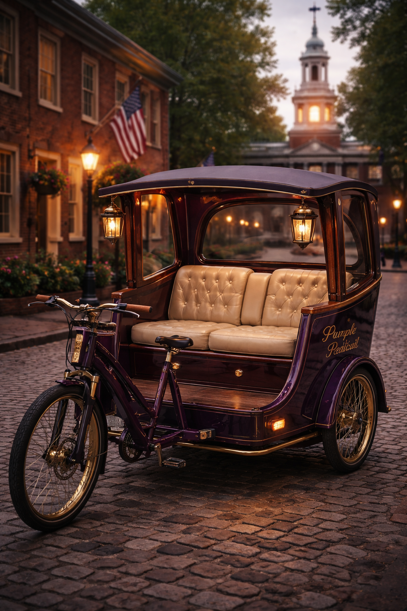 | 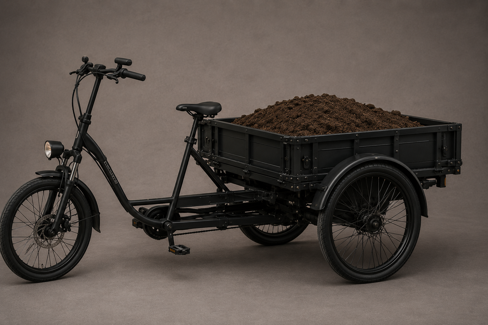 | 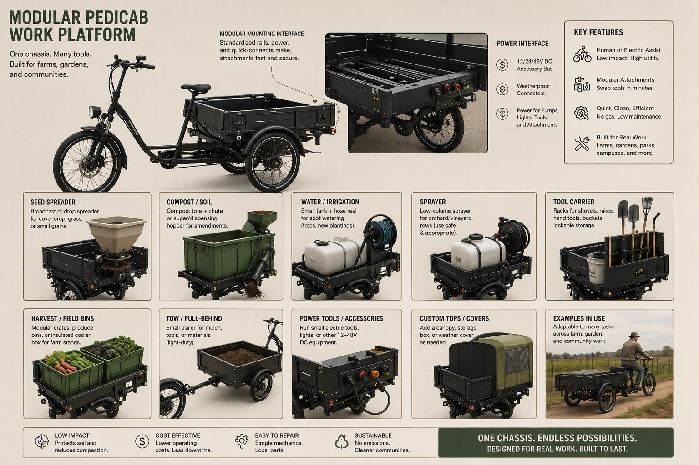 |
|                             _Not a parts spec — the visual language to chase._                              |                             _Rough terrain, tools, and work-first energy._                             |                         _Exploratory render — details will change with engineering._                         |

**Latest direction (v2) — most up-to-date thinking**

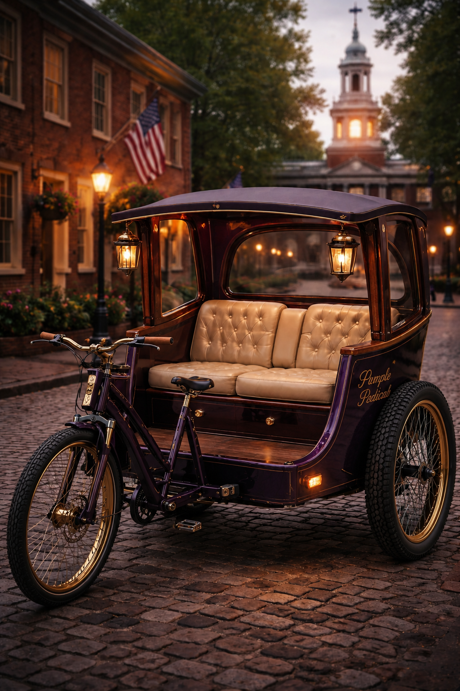

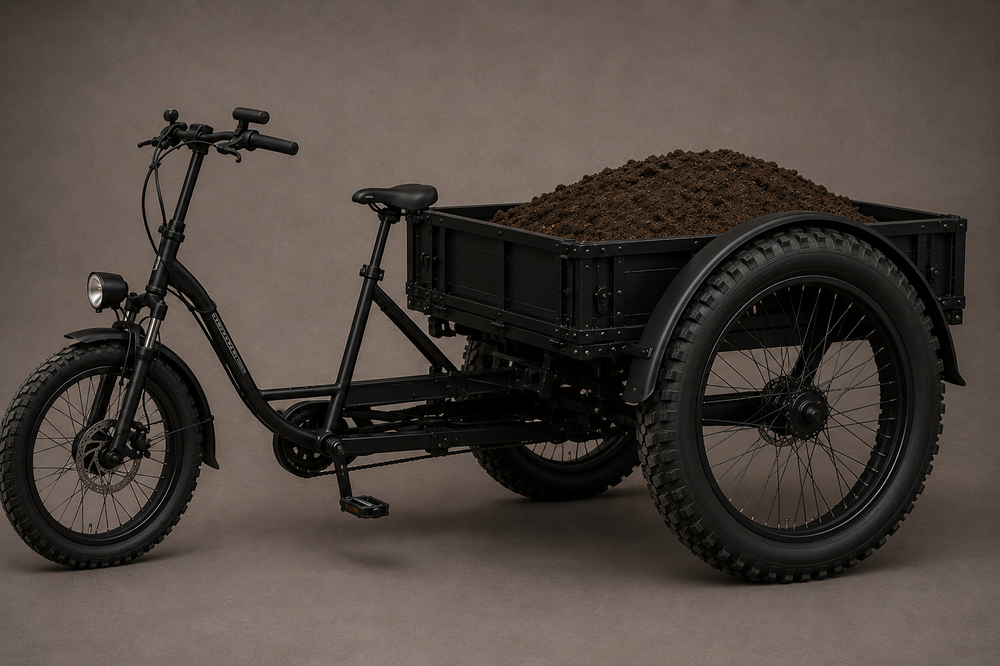

---

## Table of contents

1. [Competitive review: Main Street Pedicabs Broadway](#1-competitive-review-main-street-pedicabs-broadway)
2. [What we are building instead](#2-what-we-are-building-instead)
3. [Goals and constraints](#3-goals-and-constraints)
4. [Chassis and layout philosophy](#4-chassis-and-layout-philosophy)
5. [Modular platform: one chassis, many “tops”](#5-modular-platform-one-chassis-many-tops)
6. [Rear: suspension, wheels, and ride quality](#6-rear-suspension-wheels-and-ride-quality)
7. [Drivetrain and reliability](#7-drivetrain-and-reliability)
8. [Front suspension and steering](#8-front-suspension-and-steering)
9. [Brakes](#9-brakes)
10. [Carriage, passengers, and styling](#10-carriage-passengers-and-styling)
11. [Electrical: battery, lighting, signals, accessories](#11-electrical-battery-lighting-signals-accessories)
12. [Parking brake and operator workflow](#12-parking-brake-and-operator-workflow)
13. [Open decisions and notes](#13-open-decisions-and-notes)
14. [Reference images](#14-reference-images)
15. [PurplePedi: early days (archive)](#15-purplepedi-early-days-archive)

---

## 1. Competitive review: Main Street Pedicabs Broadway

**Vendor product page:** [The Broadway Pedicab (pedicab.com)](https://pedicab.com/product/the-broadway-pedicabs/)

Reference photos (vendor / product imagery):

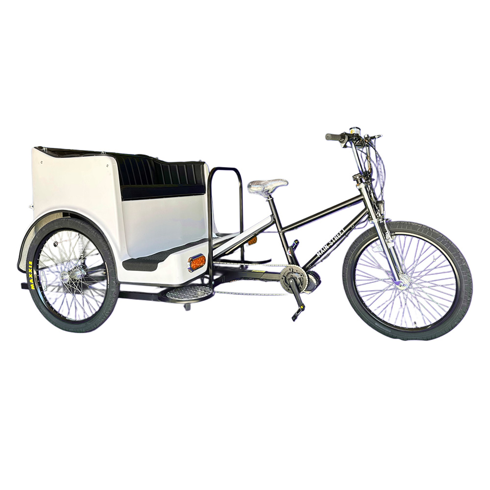

Main Street Pedicabs’ **Broadway** line appears to be built primarily from **bicycle-scale components** rather than engineered as a **dedicated passenger-transport chassis**. That design choice shows up as both **structural** and **operational** debt in real commercial use.

**Front end and frame**  
The front fork assembly is **underbuilt for repeated loaded duty**: passenger weight, steering side loads, and curb impacts concentrate on a part of the system that was never meant to see that duty cycle on a cargo vehicle. The overall frame reads as a **scaled-up bicycle** more than a **purpose-built trike or carriage-style platform**, which tends to mean **more flex**, more fatigue, and less predictable handling when the vehicle is fully loaded and covering long shifts.

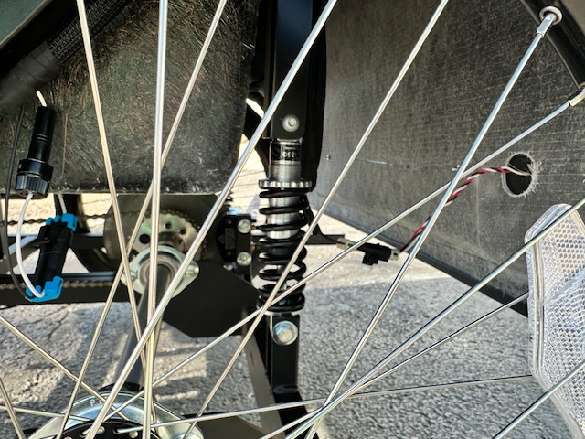

**Wheels and ride quality**  
**Relatively small tires** (for the mass and duty) hurt ride quality: they do not swallow pavement irregularities as well, so the passenger cell feels **harsh and busy** on chipseal, brick, and bad repairs. That is not only a comfort issue; it also **feeds more impulse load into the frame and drivetrain**, accelerating wear and noise.

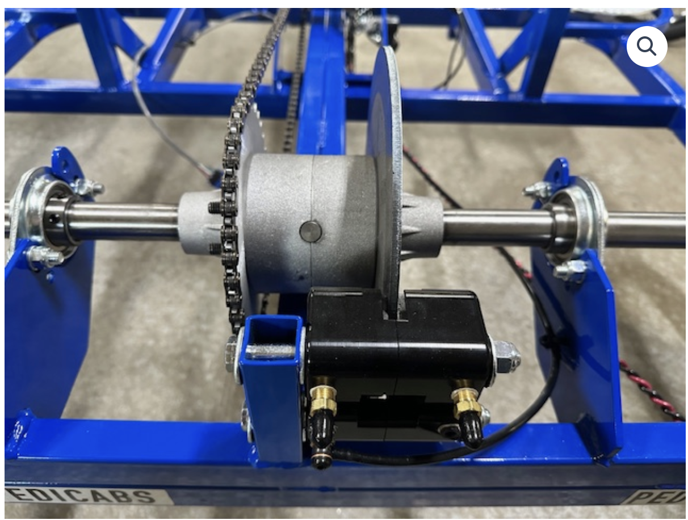

**Drivetrain and driver experience**  
A **multi-speed bicycle-style drivetrain** with a **long, exposed chain run** is a recurring pain point for operators. Not every gear is usable under load; drivers end up **hunting for a ratio** that works for passenger count, grade, and wind. That is **cognitive load** you do not want on a vehicle that is supposed to feel effortless and premium.

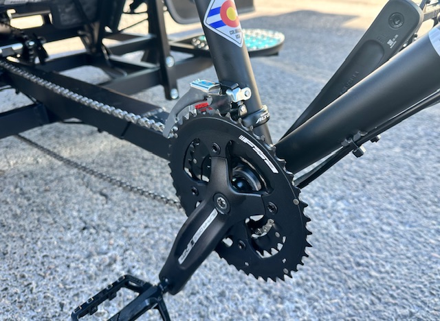

**Chain reliability**  
Chain tension and line are finicky. Too tight or too loose leads to **slip, derailment, or accelerated wear**—failure modes that are annoying on a bike and **unacceptable** on a paid ride.

**Brakes**  
**Hydraulic disc brakes** can still deliver plenty of stopping power, but they **do not fix** underlying **flex, geometry, and load-path** issues. Good brakes on a wobbly or under-damped platform still feel like a compromise.

**Passenger and operator experience (summary)**  
In practice the platform often feels **rough, loud, and tiring** for passengers, while operators fight **gearing, chain behavior, and chassis flex**. The through-line is philosophical: it behaves like a **modified bicycle** carrying people, not like a **small vehicle** designed around passengers from day one.

This review is not about trashing a competitor—it is about **naming the failure modes we are explicitly designing away from** in PurplePedi.

### Broadway — published specifications (reference)

Values below are as listed on the [Broadway product page](https://pedicab.com/product/the-broadway-pedicabs/) for the Broadway model; use for comparison and fact-checking only.

| Spec               | Details                                                                                                      |
| ------------------ | ------------------------------------------------------------------------------------------------------------ |
| Size               | 110″ × 50″                                                                                                   |
| Weight             | 185 lbs.                                                                                                     |
| Frame              | Tubular steel alloy                                                                                          |
| Fork               | 1.125″ chromoly steel                                                                                        |
| Shifters           | 21-speed grip-shifting (7-speed with motor)                                                                  |
| Front derailleur   | Shimano (brand varies by availability)                                                                       |
| Rear derailleur    | Shimano (brand varies by availability)                                                                       |
| Front brakes       | V-brake                                                                                                      |
| Rear brakes        | Hydraulic brake with dual-piston caliper                                                                     |
| Chain              | KMC                                                                                                          |
| Cranks             | FSA 44 × 33 × 22, 175 mm                                                                                     |
| Rims               | Aluminum alloy downhill                                                                                      |
| Hubs               | 48-spoke hubs                                                                                                |
| Spokes             | Stainless steel (DT Swiss) 14G                                                                               |
| Tires              | 26″ × 2.5″, 65 psi                                                                                           |
| Saddle             | Standard seat; cruiser seat optional                                                                         |
| Seat belt          | Standard                                                                                                     |
| Lighting           | 12 V LED turn signals, running and brake lights, LED headlight                                               |
| Passenger capacity | 3 adults                                                                                                     |
| FAQ                | [Owner’s manual & FAQ (PDF)](https://pedicab.com/wp-content/uploads/2024/11/MSP-Owners-Manual-11.2021-1.pdf) |

---

## 2. What we are building instead

PurplePedi targets a **purpose-built chassis**: defined load paths, suspension and wheel package chosen for **loaded ride quality**, and a drivetrain philosophy aimed at **predictable torque and low drama** (no “hunting gears” in traffic). The **first build** is aimed at a **farm / modular work top**; a **luxury horse-carriage passenger top** is planned as the **second** top on the same platform—same “quiet, smooth, boringly reliable” bar, different job.

---

## 3. Goals and constraints

**Regulatory and street-legal intent**  
Design for **visible rear lighting**, **brake lights**, and **turn signals** appropriate to how and where the vehicle will operate. Exact rules depend on jurisdiction; document the target city/state kit as you lock it.

**Overall width**  
Target **~50 inches** overall width (or whatever envelope you finalize) so the vehicle remains practical in bike lanes, door zones, and event staging.

**Gross weight and passengers**  
Design for **multiple passengers** plus driver without treating the frame like an oversized bicycle. State design gross weight assumptions here when known.

**Driver frame geometry**  
Use a **step-through** (low-step) driver frame—not a traditional **high top-tube / diamond** layout typical of men’s-style bicycles. Easier mount/dismount in traffic, at stops, and while helping passengers. Reference layout in [§4](#4-chassis-and-layout-philosophy).

**Electrical loads**  
Battery must support **e-assist motor(s)**, **running lights**, **turn signals / brake indication**, and **accessory USB charging** for phones. Battery can be **large and non-portable** if it lives in a dedicated bay.

**Charging model**  
Plug-in after shifts is fine; **regen / alternator** optional future enhancement—not required for v1.

**Human power (no assist)**  
An operator must still be able to **pedal the trike with no electrical power** (dead battery, limp-home, or any context where the motor cannot contribute). It does not need to be **easy** at full gross weight on a steep grade, but it must remain **physically achievable** without assist—gear range, mechanical drag, and what “pedalable” means at which load should be written down as the drivetrain firms up.

**Operator workflow**  
Parking brake behavior matters for pickups, drop-offs, and tipping moments—see [§12](#12-parking-brake-and-operator-workflow).

**Aesthetic and brand**  
Luxury-first: materials and components should tolerate **commercial duty** and still photograph well.

**Rear suspension architecture**  
**Intent today** is **independent rear suspension (IRS)** for the platform (farm and carriage tops), because it matches the **ride and traction** story in [§6](#6-rear-suspension-wheels-and-ride-quality). That is **not** a claim that IRS is automatically correct—it is the author’s **hypothesis** until a qualified engineer runs **weight, cost, packaging, and durability** against alternatives. Read the **non-engineer disclaimer at the top of §6** before treating IRS as immutable. Solid-axle trikes can work for slow utility and may win on **simplicity or mass** after review.

---

## 4. Chassis and layout philosophy

### Driver area: step-through frame (required)

The driver’s portion of the chassis should follow a **step-through** pattern: a **low or dropped “top” tube** so the rider can step into the cockpit without swinging a leg over a high bar. Avoid the **high horizontal top tube** of a classic diamond-frame men’s bicycle—wrong ergonomics for a working pedicab where you get on and off constantly, help passengers, and move around the bike at stops.

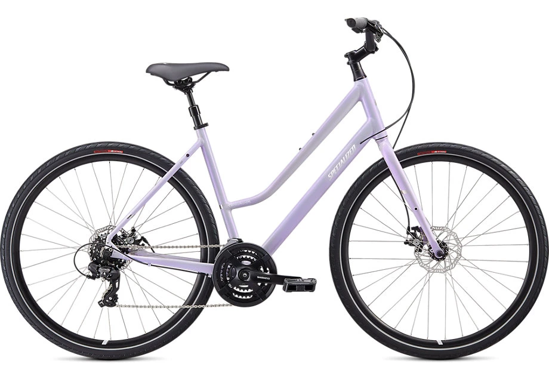

- **Trike / carriage logic**, not “big bike with a box.”
- **Passenger sightlines**: riders **sit higher than the driver** where possible so they are not staring at the driver’s back (contrast with low “Main Street”-style rear layouts).
- **Battery packaging**: under seats and/or a **rear trunk** behind the carriage so pack volume is not the limiting factor.
- **Width and stability** tradeoffs documented as the frame sketch evolves.

---

## 5. Modular platform: one chassis, many “tops”

The long-term product idea is a **standardized chassis** with a **swappable rear “top” module**. The chassis (steering, brakes, suspension, drivetrain, electrical backbone) stays consistent, while the rear payload area can be swapped to fit different jobs and different customers. **Build order:** ship the **farm / work top first**, then the **luxury horse-carriage passenger top**—so the modular bed and interfaces are proven before the showpiece carriage.

**Why it matters**

- **Owners can change use-cases** without buying a whole new vehicle.
- **Fleet operators** can standardize maintenance on one platform.
- **Seasonal business** becomes practical (tourism vs utility vs events).
- **Custom builds** become practical (events, niche commercial work, festivals).

**First “top” (v1)**

- **Farm / off-road utility**: a battery-powered, modular “farm tool” on the same chassis. The goal is a high-quality utility platform that can do light work where gas equipment (or a tractor) is overkill.
  - **Competition (urban / light utility—not farm-first)**: products like the [Oh Wow Cycles Conductor Plus Rickshaw](https://ohwowcycles.com/products/conductor-plus-rickshaw) and [Vok U](https://vokbikes.com/vok-u/) show what exists for narrow paths, city maintenance, and service teams. They are **not really built for farm work**—different duty cycle, different loads, and different attachment expectations than a field-first modular bed.

  |                                                    [Oh Wow Cycles — Conductor Plus](https://ohwowcycles.com/products/conductor-plus-rickshaw)                                                    |                                                  [Vok U](https://vokbikes.com/vok-u/)                                                  |
  | :----------------------------------------------------------------------------------------------------------------------------------------------------------------------------------------------: | :------------------------------------------------------------------------------------------------------------------------------------: |
  | <a href="https://ohwowcycles.com/products/conductor-plus-rickshaw">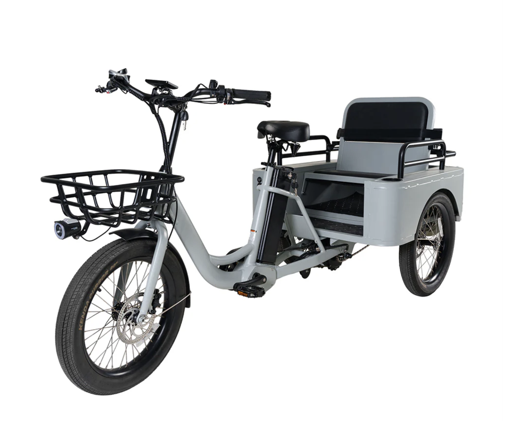</a> | <a href="https://vokbikes.com/vok-u/">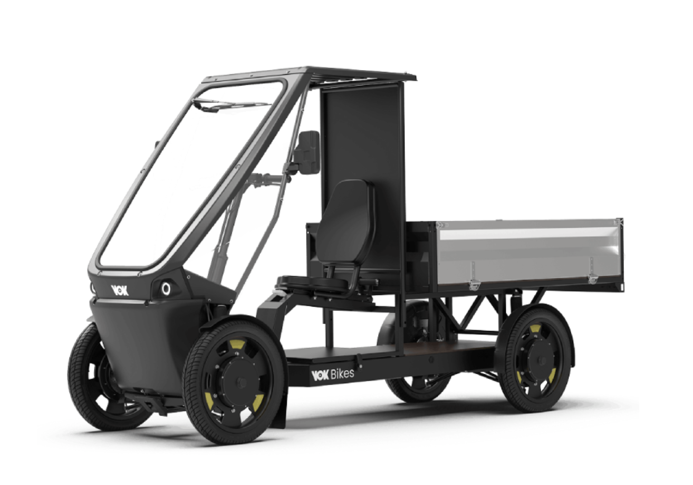</a> |
  - Consider **thicker / higher-volume tires** (and potentially different tread) to improve comfort and traction off-road.

### Farm top: example implements / attachments

Teaser previews for farm + modular work mood and AI board: **[top of document](#visual-teasers)**.

Think of the rear as a **truck bed + mounting interface**. Plan for a **dump / tilt** function: a **lever** (mechanical first—power tilt optional later) so the operator can **raise the bed on a pivot** and **tip it at an angle** for **gravity offload** of loose material—**dirt, compost, mulch, gravel**, etc.—without shoveling the whole load by hand. Ride-height **latches**, **max tilt angle**, and **loaded CG** with the chassis parked need real engineering; the intent is **small-truck dump-bed behavior**, not a cosmetic flat deck only.

The “attachments” can be swappable just like the tops:

_Sketch note:_ I’d like the **truck-bed tail / back door** to hinge so it can **open down to the ground**—a ramp or load bridge for rolling equipment and heavy bins on/off the bed. **Height and length still need to be checked** against real gear and ground clearance; for now it’s a “would be nice” direction, not a locked spec.

### Farm / utility v1 — frame, independent rear suspension, and drivetrain (example)

*Example concept art — not production geometry or BOM.* The study below highlights a **step-through / low step-over frame** suited to mounting a **flat work deck** (farm top), **independent rear suspension** to keep both rear wheels planted in ruts and side-slope, and a **rear-biased drivetrain layout** (motor + reduction at the axle) as the **reference concept** for torque, packaging, and service access.

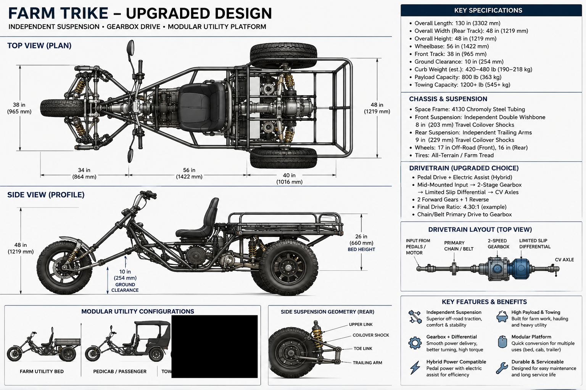

_The farm concept image above is AI-generated._ It’s in the right neighborhood for the modular farm-top idea, but treat it as **concept art**, not engineering truth.

- **Seed spreading**: broadcast spreader or drop spreader for cover crop, grass, or small grains.
- **Compost / soil**: compost tote + chute, or a small auger/dispensing hopper for amendments; **pairs with dump / tilt bed** for loose bulk offload.
- **Dump / tilt bed**: **lever** (mechanical v1) to pivot the truck bed upward and **tip the load** for offload—dirt, compost, mulch, gravel—aligned with the paragraph above; coordinate latches and tailgate / ramp behavior in CAD.
- **Spraying**: low-volume sprayer for orchard/vineyard rows (where appropriate and safe).
- **Tool carrier**: racks for shovels, rakes, hand tools, buckets; lockable storage.
- **Harvest / field bins**: modular crates, produce bins, or insulated cooler box for farm stands.
- **Tow / pull-behind**: small trailer for mulch, tools, or materials (light-duty).
- **Power interface**: a protected DC accessory bus (12/24/48V) for pumps, lights, and simple electric attachments.

**Why this is exciting**

- Quiet, low-maintenance utility platform (no gas) for farms, estates, parks, campuses, and trails.
- One chassis that can be re-used for passenger tours _or_ utility work by swapping the top.

**Second “top” (v2)**

- **Horse carriage / luxury passenger cabin**: the showpiece **tourism / events** top—same chassis, different rear module once the farm bed and mounting story are validated.

**Other “tops” to offer**

- **Cargo**: deliveries, park maintenance, event load-in/out.
- **Trash / compost pickup**: municipal and campus routes with tight turns.
- **Advertising / activation**: billboards, brand experiences, sampling.
- **Parks department**: tools, bins, and light duty transport on paths.

**Owner-built / custom tops**

The platform should also support **fully custom builds** so owners can create whatever they need on top (events, niche commercial work, special payloads).

Implementation note: define a mechanical + electrical interface (mount points, load rating, wiring harness connectors) so swapping tops is safe and repeatable.

---

## 6. Rear: suspension, wheels, and ride quality

This section leads the technical story **from the contact patch backward**: fix ride and load handling first, then propagate decisions forward.

<strong>⚠️ 🚨 ⚠️ 🚨 ⚠️ 🚨 ⚠️</strong>

<h2 align="center"><strong><u>I am not a mechanical engineer — treat this whole section as questions, not answers.</u></strong></h2>

<strong>⚠️ 🚨 ⚠️ 🚨 ⚠️ 🚨 ⚠️</strong>

What follows is **my current best guess** at what will feel right on **rough ground and long shifts**. I **believe** **true independent rear suspension (IRS)** is the right north star for ride and keeping both rear tires loaded—but I **do not know** if that is **worth the weight, cost, complexity, and unsprung mass** once everything else on the vehicle is stacked in (battery, dump bed, motor path, pedal drive, service access). There may be a **lighter**, **cheaper**, or **simpler** architecture that is “good enough,” or a **hybrid** (e.g. semi-independent / twist / better tires and damping only) that a real suspension engineer would prefer. **I could be wrong about IRS—or about anything else in this README.** The job of a hired frame/suspension engineer is to **challenge every assumption here** and recommend what actually meets the load cases and budget.

**Independent rear suspension (IRS) — intent**  
**If an IRS-class rear still wins after professional trade study**, the chassis should pursue **true IRS** (each rear wheel moves on its own kinematic path) so the vehicle can **filter bumps**, **keep both tires loaded** on uneven surfaces, and avoid the **hobby-horse pitch** common when one wheel hits a hole and the whole rear axle tilts. That directly supports the **“smooth ride”** promise for operators (long shifts, farm tasks) and passengers (comfort and perceived quality).

**Why “smooth” is non-negotiable here**  
Rough inputs do not only feel bad—they **fatigue passengers**, **shake cargo**, and **feed impulse loads into the frame, motor mounts, and chain path**, which accelerates wear and noise. In a **split-rear-wheel layout**, IRS is a strong lever for **rear axle independence**, but **tires, damping, sprung mass, and simpler axle concepts** can also move the needle—none of this replaces a proper trade study.

**Reference hardware class (not a locked BOM)**  
Off-road **buggy / crosskart** markets package compact **trailing-arm or A-arm rear modules** with hubs, brakes, and pickup points—useful as a **reference for layout and components**, even though PurplePedi loads and gearing will differ.

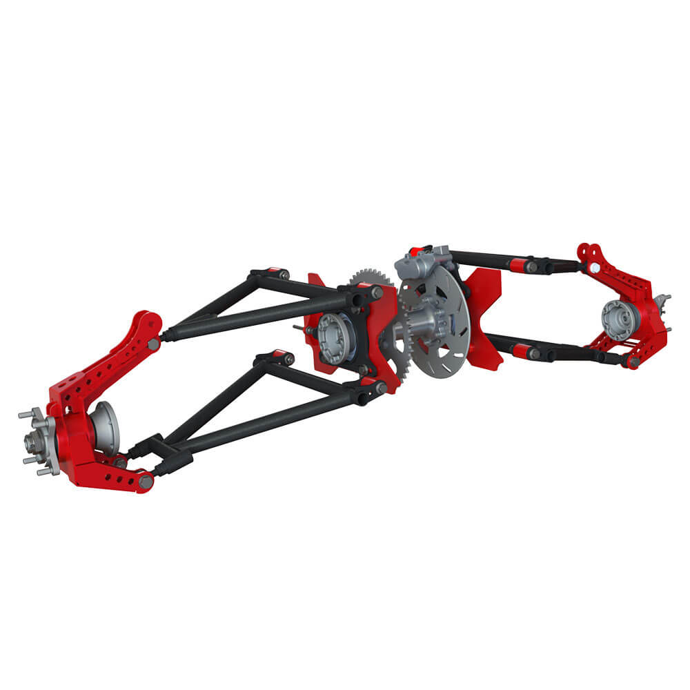

**Challenges (call them out early)**  
IRS plus human-scale pedal assist is **not** a bolt-on bicycle problem:

- **Torque path**: independent wheels want a **split torque** solution—**differential**, **two hub motors**, **motor + differential**, or a **single driven wheel** (simple but asymmetric). A **long bicycle chain** to both rear corners does not map cleanly to IRS without **jackshafts**, **sliding joints**, or **complex chain tension** as each arm cycles.
- **“Car-like” gearing**: loaded duty favors **fixed or hub reduction**, **gearbox at the frame**, **CVT**, or **single-speed reduction to axle**—not a **multi-speed derailleur** hunting under passenger load (see [§7](#7-drivetrain-and-reliability)).
- **Unsprung mass**: heavy hubs, brakes, and half-shafts at the wheel fight ride quality unless spring/damper choices account for it.
- **Packaging**: motor, reduction, and battery must live **around** suspension pivots without binding steering, travel, or service access.
- **Alignment and maintenance**: two corners means **bushings, toe, and camber** discipline—more like a small car than a bike shop tune-up.
- **Cost / complexity**: IRS trades **simplicity** for **ride and traction**; this README **currently assumes** that trade is worth it—but a BOM and field review might say otherwise.

**Product direction (question the README is answering)**  
For a **motorcycle-scale / go-kart-scale off-road** machine with **pedal + e-assist**, there is rarely one “perfect” shelf IRS that also solves **bicycle-chain drive to both wheels**. Real builds usually converge on **hub motors**, **mid-drive through a differential**, or **mid-drive to one side with mechanical compromise**. Crosskart/buggy IRS kits help with **suspension corners**; the **final-drive architecture** still has to be chosen for **torque, chainline, and service** together with the frame builder.

**Tires**  
Target a wheel/tire package that improves **rollover and comfort** vs small BMX-scale rubber on heavy trikes. Current reference direction:

- [Vee Tires Speedster BMX](https://veetires.com/products/speedster-bmx) (whitewall aesthetic—revisit final diameter/load rating for true passenger duty)

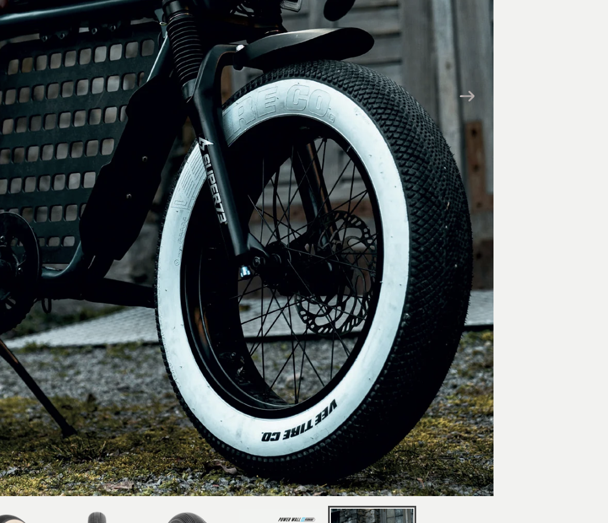

**Rear suspension (hybrid aesthetic + function)**  
Nostalgic **leaf spring look** with serious work done by **coilovers**:

- **Coilover**: ~90% of suspension work (Fox Racing Shox, RockShox, DNM Suspension, or equivalent class)
- **Leaf spring**: visual + light secondary support—**do not** preload heavily; let it engage more under heavier loads

**Layout sketch**

1. **Trailing arm (per wheel)** — pivot near chassis center, wheel at rear of arm.
2. **Coilover** — bottom on arm, top on frame.
3. **Leaf spring** — under frame, ends near trailing arms; centerpiece look.

Leaf spring part reference: `http://rvtraderaccessories.com/products/double-eye-trailer-leaf-spring-25-inch-1-000-lbs?variant=45150198005943&utm_source=chatgpt.com&utm_medium=feed`

---

## 7. Drivetrain and reliability

**Design intent**  
Avoid a fragile **long-run bicycle derailleur stack** as the core answer for a loaded commercial vehicle. Prefer solutions with **predictable ratios**, **clean chainline**, and **low adjustment drama** (internal gear hubs, gearbox-at-frame, or other architectures TBD with the frame builder).

**Chain management**  
Any trike-length chain path needs a deliberate **tensioner / idler** strategy so “too tight / too loose” is not a recurring field failure.

**PurplePedi drivetrain concept (v1)**  
Early idea for layout / packaging—iterate with the frame builder as the hub, differential, and motor choices firm up.

**PurplePedi transmission layout concept (v2)**  
Newer sketch for how **transmission / final-drive packaging** might sit relative to the rear axle—still exploratory; lock up once motor, hub or gearbox, and differential choices are set.

**Rear tires: bigger diameter for farm _and_ pedicab**  
Bias toward **larger rear wheels / tires** (within brake, gearing, and frame limits). More **rollover** and footprint help on **rough farm surfaces**—ruts, gravel, pasture tracks, soft ground—and the same trait improves the **pedicab experience** on **bad urban pavement** (chipped asphalt, brick, seams, potholes). One rear-wheel strategy that supports both **farm work** and **passenger carriage** duty without feeling like a skinny BMX-class rear end on a heavy trike.

**Rear hub / brake reference (Main Street–style context)**  
The image below illustrates the **axle-mounted disc** and **chain drive** layout common on existing pedicab designs—useful as a **reference**, not necessarily the final PurplePedi architecture.

---

## 8. Front suspension and steering

**Fork direction**  
High-end, **duty-rated** front suspension appropriate to **mass and braking**, not a passenger fork chosen from the MTB catalog by vibe alone.

- **Primary reference**: [EXT Ferro Forks](https://fullthrottleev.myshopify.com/products/ext-ferro-forks?variant=50928371466555&utm_source=chatgpt.com&utm_medium=feed)
- Final choice must match **axle**, **brake mount**, **offset**, **travel**, and **head tube** planned by the custom frame.

---

## 9. Brakes

**Front caliper (primary)**  
[Shimano Saint BR‑M820](https://bike.shimano.com/en-NA/products/components/pdp.P-BR-M820.html)

**Goals**

- Strong, reliable stopping power
- Smooth, progressive braking (no jerking)
- Stable under load (multiple passengers)
- **~70% front / 30% rear** bias as a starting philosophy

**Front (primary)**

- Caliper: Shimano Saint M820 (4-piston)
- Rotor: 220 mm
- Pads: resin (organic)
- Role: main stopping force, smooth engagement

**Rear (axle-mounted)**

- Caliper: Magura MT5 or MT7 (4-piston)
- Rotor: 203–220 mm on rear axle / differential
- Pads: organic or semi-metallic
- Role: stability + controlled deceleration (avoid rear lockup)

**System notes**

- Target **~70/30** front-to-rear bias; rear less aggressive than front
- **Steel-braided** hydraulic lines for consistent feel
- Confirm compatibility with **large rotors (203–220 mm)**

---

## 10. Carriage, passengers, and styling

**Layout**  
Rear seating should reinforce the **“riders higher than driver”** sightline goal for Main Street–style routes vs event staging.

**Materials (open)**

- **No hemp plastic** for carriage structure.
- Directions under consideration: **50s riveted raw aluminum**, **all wood**, **wood + metal hybrid**, or **steampunk / carriage** silhouettes.
- **Raw aluminum** could remain a product variant even if wood becomes the hero build.

**Sourcing**  
Explore **Amish carriage makers** (or similar coachbuilders) for commissioned wood bodies: cost, lead time, and serviceability vs **in-house build**.

### Design inspiration (reference)

Small previews of this library also appear **[at the top of this document](#visual-teasers)**.

This is the north-star visual direction—not a literal part spec, but the mood and material language to chase (luxury, metal, craft).

### Concept exploration — aluminum carriage (v1)

Early AI / render exploration for a **riveted raw-aluminum** carriage direction. For **seating and upholstery**, the cue is an **aluminum pilot-style chair with leather**: structured, aviation-grade feel, not a squishy bench.

| Seat / upholstery inspiration (pilot chair)                                 | Aluminum carriage concept v1                                      |
| --------------------------------------------------------------------------- | ----------------------------------------------------------------- |
|  | 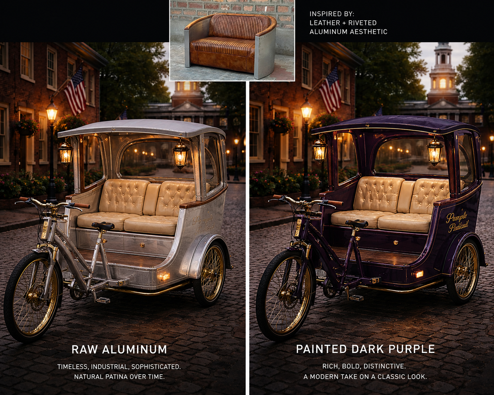 |

### Concept exploration — wood carriage (v1)

Parallel direction: **wood body** language (commissioned coachwork vs shop-built TBD).

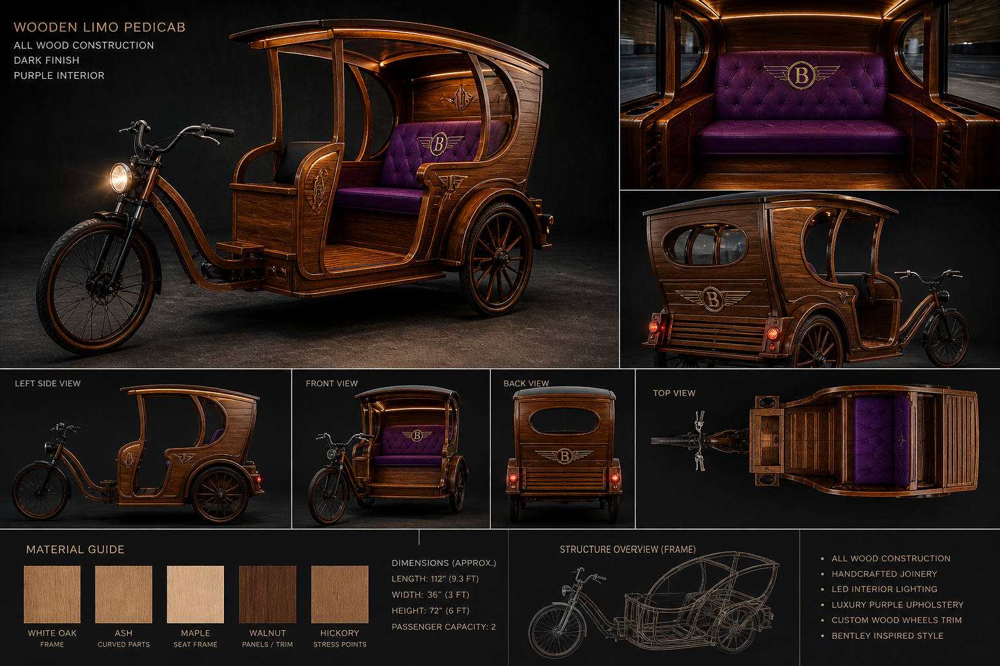

---

## 11. Electrical: battery, lighting, signals, accessories

- **Battery**: sized for **motor + lights + signals + USB**; location **under seats** and/or **rear trunk**.
- **Charging**: end-of-shift plug-in; regen optional later.
- **Lighting**: front and rear; **brake activation** tied to hydraulic system or dedicated sensors (TBD with builder).
- **Turn signals**: integrated with visible rear lighting plan.
- **USB**: passenger convenience outlets where appropriate.

---

## 12. Parking brake and operator workflow

During pickups and drop-offs the driver often needs **hands free** to help passengers and close the sale (tips). A **real parking brake** (or equivalent positive hold) matters more than on a leisure bike.

**Ideas**

- Integrate with a **three-clutch / suicide-style handle** if it can safely **hold all brakes** without creep.
- Possible custom **latch** behavior (gas-pump style) for quick engage/release.
- Document failure mode: what happens if the rider forgets to release before pedaling.

---

## 13. Open decisions and notes

Consolidated from ongoing email / design threads:

- **Luxury-first**: do not cheap out on duty-rated systems.
- **AI renders**: useful for shape exploration; watch for wrong ergonomics (e.g. seat height vs driver).
- **Wood carriage + purple upholstery**: color pairing TBD.
- **Historical ops**: early service-era photos live in [`images/oldschool/`](images/oldschool/) (see [§15](#15-purplepedi-early-days-archive)).

**Still floating from email / sketches**

- Back-seat height reference, steampunk carriage explorations—add files under `images/` when ready and link here.

---

## 14. Reference images

| Image                                          | Description                                                  |
| ---------------------------------------------- | ------------------------------------------------------------ |
| `images/mainstreet-broadway.jpg`               | Broadway — overall product / context photo (§1)              |
| `images/Broadway-pedicab-shocks.jpg`           | Broadway — rear shock / suspension detail (§1)               |
| `images/Broadway-pedicab-crank-drivetrain.jpg` | Broadway — crank & drivetrain (§1)                           |
| `images/inspiration.PNG`                       | North-star design inspiration — also teaser at doc top (§10) |
| `images/farminspiration.png`                   | Farm inspiration — also teaser at doc top (§5)               |
| `images/seat-v1.png`                           | Seat inspiration — aluminum pilot chair / leather (§10)      |
| `images/v1-concept-aluminum.png`               | Carriage concept v1 — aluminum (§10)                         |
| `images/v1-concept-wood.png`                   | Carriage concept v1 — wood (§10)                             |
| `images/drivetrain-v1.png`                     | Drivetrain concept v1 (§7)                                   |
| `images/transmission-v1-idea.png`              | Transmission layout concept v2 (§7)                          |
| `images/mainstreet-drivetrain-rear.png`        | Rear drivetrain / hub reference — competitor context         |
| `images/ohwow-competition.png`                 | Oh Wow Cycles — competition reference photo (§5)             |
| `images/VOKUbike-competition.png`              | Vok U — competition reference photo (§5)                     |
| `images/wheels.png`                            | Wheels / tire reference (§6)                                 |
| `images/step-through-frame-reference.png`      | Step-through driver frame reference — example bicycle (§4)   |
| `images/framefarm-v1.png`                      | Farm top — hand-drawn frame sketch v1 (§5)                   |
| `images/farmconcept-v2.png`                    | Farm modular work platform (AI) — teaser at doc top + §5     |
| `images/farm-v1-concept2.PNG`                  | Farm / utility v1 — frame, IRS, drivetrain — §5 (between truck-bed sketch and farm concept v2) |
| `images/farmconcept-v2-trailer-trays.png`      | Farm concept + plug flats on flatbed & pull-behind (§5)      |
| `assets/media/image3.png`                      | Leaf spring reference (§6)                                   |
| `images/Rear-Suspension-Kit-for-Crosskart-Buggy.jpg` | Crosskart / buggy rear IRS kit — reference hardware class (§6) |
| `images/oldschool/*.png`                       | Early PurplePedi ops archive (§15)                           |

---

## 15. PurplePedi: early days (archive)

Photos from the first era running the pedicab as a **commercial service**—unveiling, training, weddings, riders on board. Not build specs; just history and vibe.

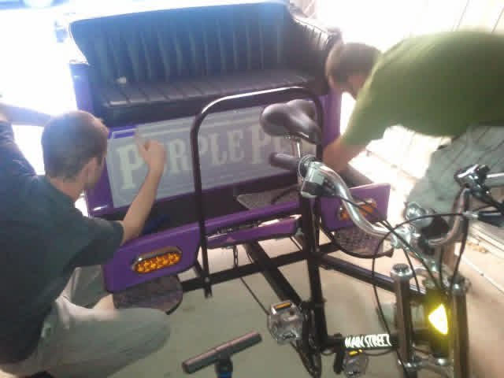

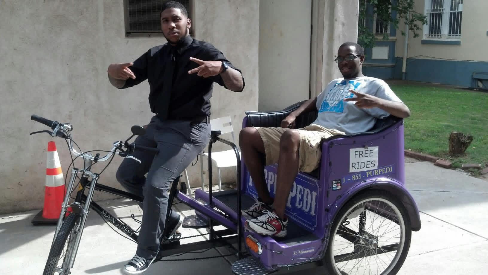

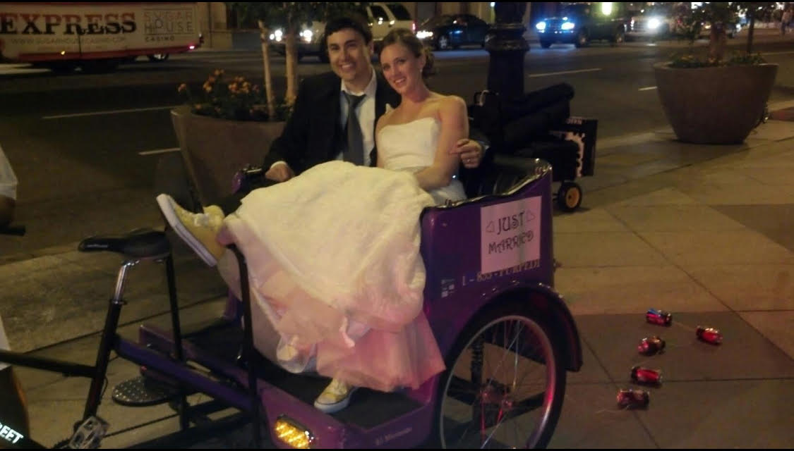

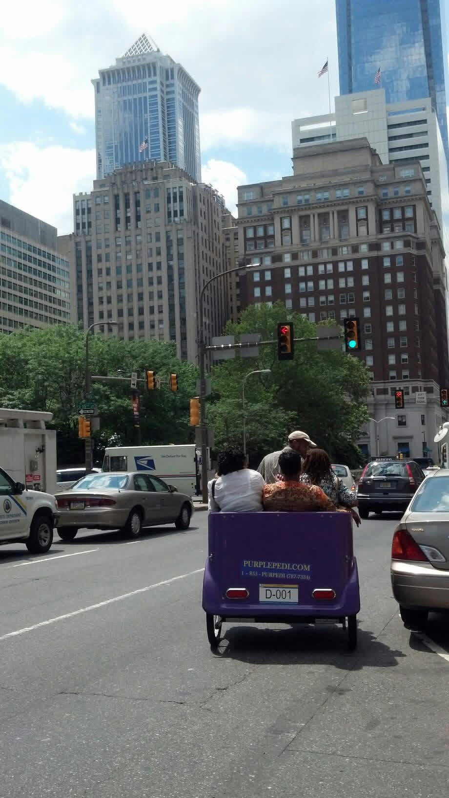

